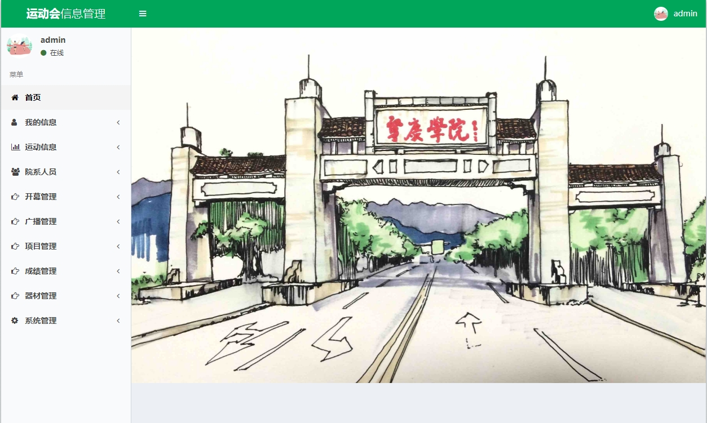
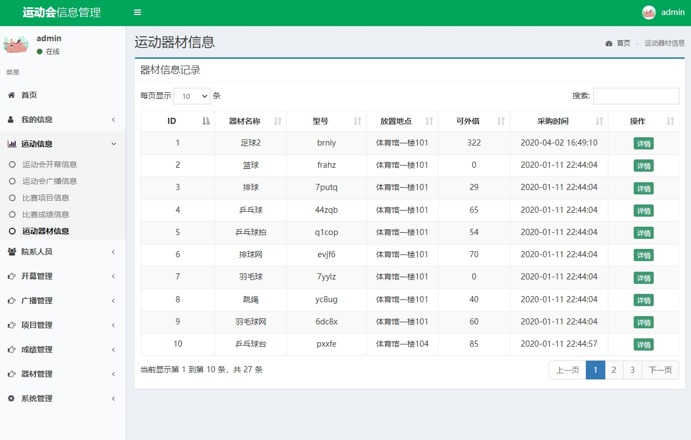
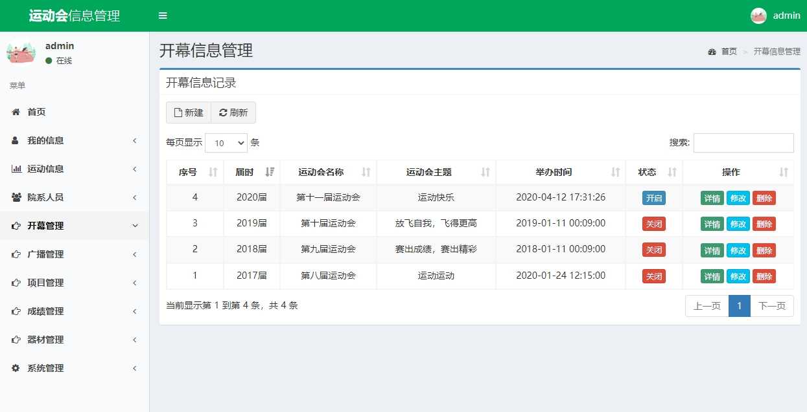
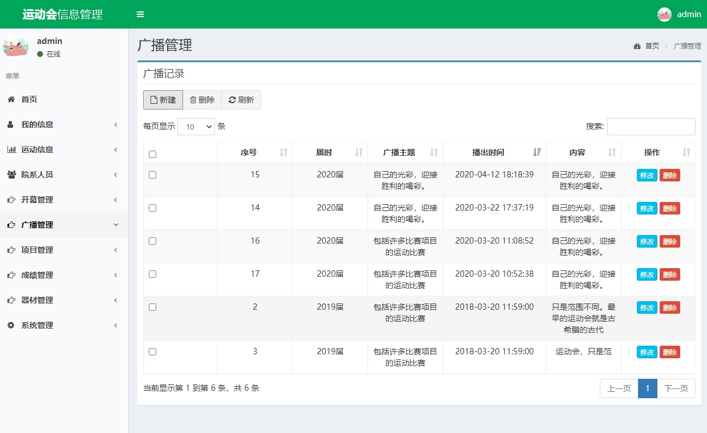

 **郑重声明：项目经过本地测试，确保可以运行， 可以用于学习和毕业设计参考~** 

#### 1.项目介绍
- 采用了Java语言和MySQL数据库来实现。系统按预定的算法完成了创办运动会、广播公告公示、赛事项目拟订、报名参赛、赛后成绩录入、查看比赛成绩、院系人员的信息存储、反馈建议、访问日记等功能。

- 关键词： 高校运动会；信息管理系统；JavaWeb；SSM

- 管理员账号密码：admin/admin

- 运行环境： jdk8+tomcat8+mysql+IntelliJ IDEA+maven

- 技术选型：spring+spring mvc+mybatis+bootstrap+jquery

#### 2.项目部署
- 下载源码，本地电脑新建一个数据库，导入smms.sql文件至数据库中。
- 使用IDEA打开yundong目录，修改数据库信息、模板存放路径等：/yundong/src/main/resources/dbconfig.properties
- java依赖安装加载完成后，如果需要本地运行，自行下载tomcat9来启动，访问本地地址，能正常访问就代表已经在正常的启动运行了:
- 后台登录 http://localhost:8080

#### 3.项目部分截图

